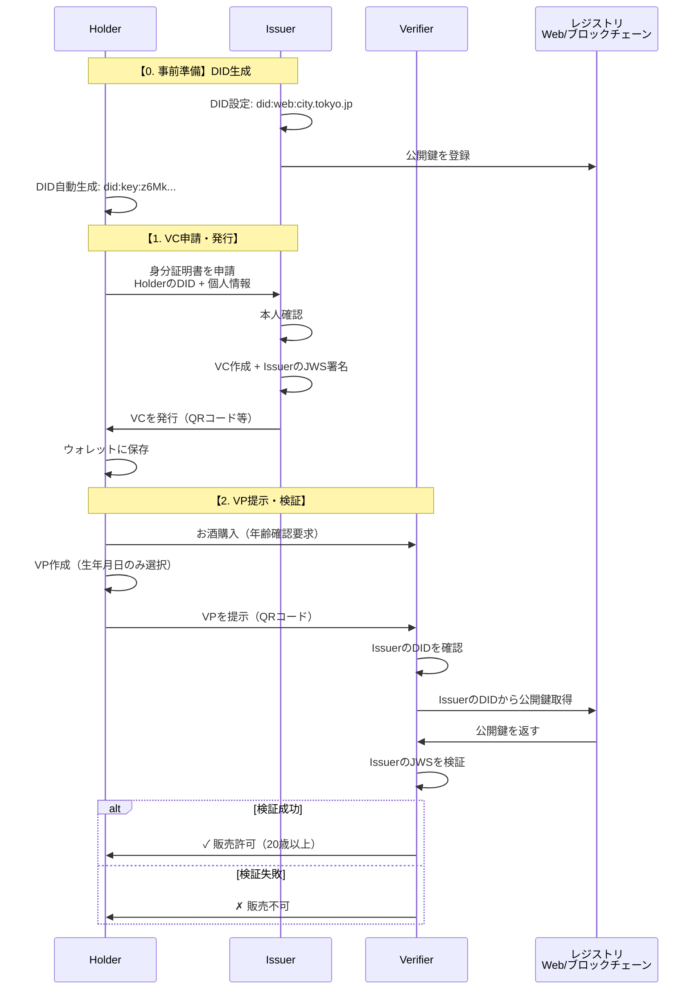

# DID/VC Educational Demo

W3C標準準拠のDID（Decentralized Identifiers）とVC（Verifiable Credentials）を学習・体験できるインタラクティブデモ

## デモサイト

**[デモを体験する](https://takuya-motoshima.github.io/did-vc-dist/)**

## 概要

このプロジェクトは、分散型アイデンティティ（DID）と検証可能な証明書（VC）の基本概念を理解し、実際にブラウザで動作を確認できる教育用デモです。

### 学習目標

- DID/VCの基本概念と仕組みの理解
- VC発行からVP提示までの実際のフロー体験
- 選択的開示（プライバシー保護）の仕組み理解
- QRコードを使った実デバイス間での認証体験

## システム全体のフロー



## アーキテクチャ

### 登場人物と要素

| 名称 | 役割 | 具体例 | DID必要性 |
|------|------|--------|-----------|
| **Holder** | 証明書を保有する個人 | 田中太郎（一般市民） | 必須 |
| **Issuer** | 証明書を発行する機関 | 市役所、大学、病院 | 必須 |
| **Verifier** | 証明書を検証する側 | コンビニ、銀行、企業 | 不要 |
| **DID** | 識別子 | did:web:city.tokyo.jp | - |
| **VC** | デジタル証明書 | 身分証明書、卒業証明書 | - |
| **VP** | 提示用データ | VCから必要な部分だけ抽出 | - |
| **Wallet** | VCの保管場所 | スマホアプリ、ブラウザ | - |

## 技術仕様

### 準拠標準
- [W3C Verifiable Credentials Data Model v1.1](https://www.w3.org/TR/vc-data-model/)
- [W3C Decentralized Identifiers (DIDs) v1.0](https://www.w3.org/TR/did-core/)
- JSON Web Signature (JWS) for cryptographic proofs

### 実装技術
- **フロントエンド**: Vanilla JavaScript (ES6+)
- **暗号化**: Web Crypto API
- **データ交換**: QR Code (本格実装では DIDComm 推奨)
- **ストレージ**: LocalStorage (デモ用、実用ではより安全な手法を使用)

## デモの使い方

### 基本デモ

1. **スマートフォン**: ホルダーアプリで証明書を発行・管理
2. **PC**: 検証者アプリでQRコードを読み取り、認証を実行
3. **体験内容**:
   - 個人情報入力→VC発行
   - シナリオ選択（本人確認 / 年齢認証）
   - VP生成→QRコード提示
   - 認証成功→結果確認

### 選択的開示の体験

- **本人確認シナリオ**: 氏名、生年月日、住所を開示
- **年齢認証シナリオ**: 成人であることのみ証明（具体的年齢は非開示）

## セキュリティ考慮事項

**デモ用途のため、以下は簡略化されています**

- 秘密鍵はLocalStorageに保存（実用環境では Hardware Security Module等を使用）
- 本人確認プロセスは省略（実際はKYC手続きが必要）
- DIDレジストリは簡易実装（実用環境ではブロックチェーン等を使用）

## 学習リソース

### 主要概念

#### DID（Decentralized Identifier）
分散型識別子 - デジタル世界での固有ID

#### VC（Verifiable Credential）
検証可能な証明書 - デジタル版の証明書

```json
{
  "@context": ["https://www.w3.org/2018/credentials/v1"],
  "type": ["VerifiableCredential"],
  "issuer": "did:web:city.tokyo.jp",
  "credentialSubject": {
    "id": "did:key:z6Mk...",
    "name": "田中太郎",
    "birthDate": "2000-01-01"
  },
  "proof": {
    "jws": "eyJhbGci..."
  }
}
```

#### VP（Verifiable Presentation）
検証可能な提示 - 必要な情報だけを選んで提示

#### JWS（JSON Web Signature）
デジタル印鑑 - 証明書が本物であることを保証

## 実用化への展望

### 想定される応用分野
- **身分証明**: マイナンバーカードのデジタル化
- **学歴証明**: 卒業証明書、資格証明書
- **医療**: 診療情報、ワクチン接種証明
- **金融**: KYC、信用証明

### 実装時の考慮事項
- **プライバシー**: Zero-Knowledge Proof の活用
- **相互運用性**: 複数のDIDメソッド対応
- **ユーザビリティ**: 一般ユーザー向けのシンプルなUI/UX
- **法的準拠**: 各国のデジタルID法制への対応

## 参考資料

### 公式仕様
- [W3C Verifiable Credentials](https://www.w3.org/TR/vc-data-model/)
- [W3C Decentralized Identifiers](https://www.w3.org/TR/did-core/)
- [DID Method Registry](https://www.w3.org/TR/did-spec-registries/)

### 実装例
- [Microsoft ION](https://github.com/decentralized-identity/ion)
- [Hyperledger Indy](https://www.hyperledger.org/use/hyperledger-indy)
- [Ethereum DID Registry](https://github.com/uport-project/ethr-did-registry)

## 作成者

**Takuya Motoshima**

* [github/takuya-motoshima](https://github.com/takuya-motoshima)
* [x/takuya_motech](https://x.com/takuya_motech)
* [facebook/takuya.motoshima.7](https://www.facebook.com/takuya.motoshima.7)

## ライセンス

[MIT](LICENSE)